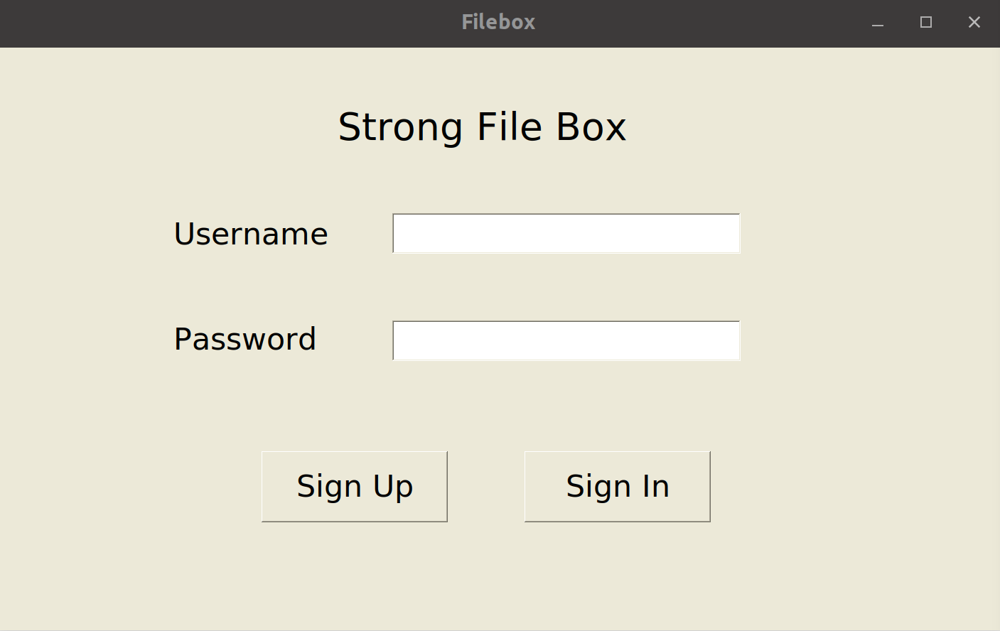
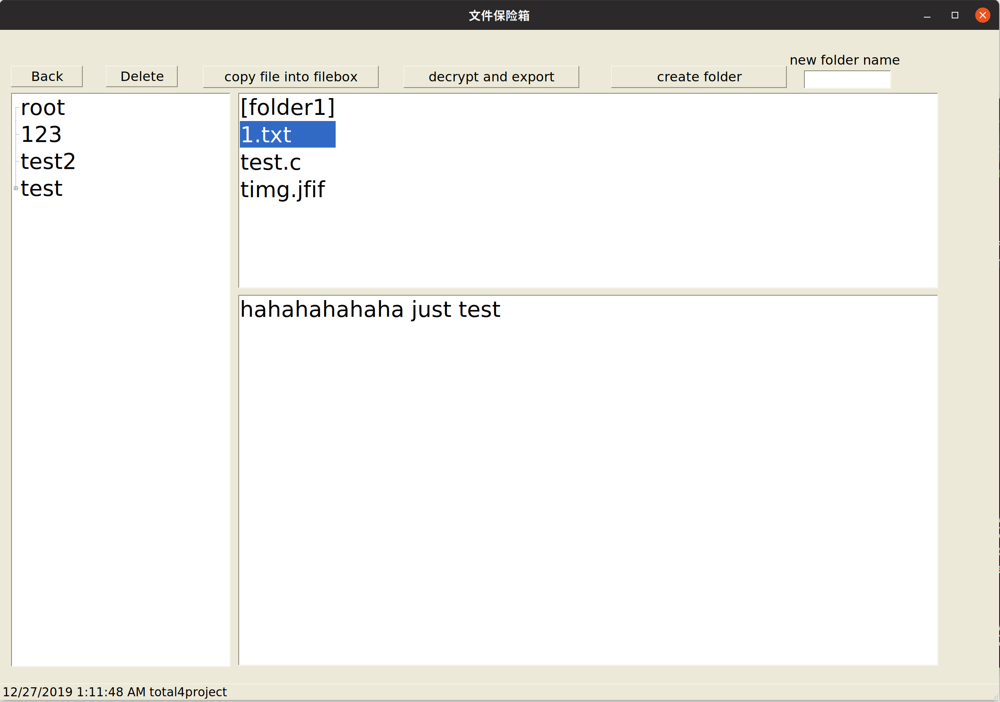
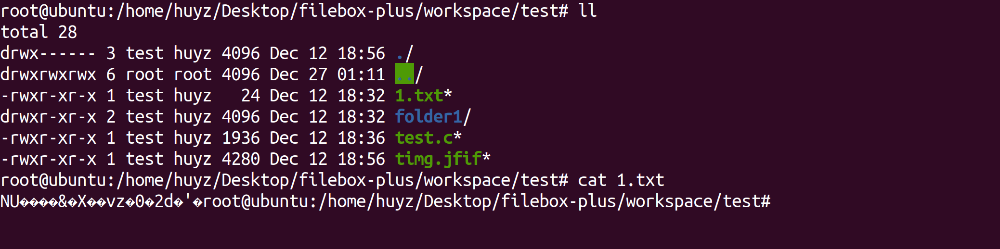

# FileBox-plus
基于系统调用的加密型文件保险箱

在基本型的文件保险箱上实现了加密存储，以此来抵御“脱机攻击”。

IS415 系统软件课程设计 大作业

## Code

|---- FileExplorer	UI界面模块

|---- applicationLayer	应用层加解密接口

|---- kernelModule	系统调用重载

|---- workspace	工作目录

## Install

1.编译内核驱动模块

```
cd kernelModule
make
insmod Filebox.ko
```

2.编译应用层加解密接口

```
cd applicationLayer
gcc -o ../workspace/encrypted_copy.out main_for_encrypted.c
gcc -o ../workspace/decrypted_copy.out main_for_decrypted.c
gcc -shared -o ../libfilebox.so -fPIC main_for_so.c
```

3.编译UI界面

```
msbuild FileExplorer.sln -p:Configuration="debug" -p:Platform="x86"
```

## Usage

运行环境：Ubuntu19.04 

内核版本：Linux 5.0.0-25

```
mono FileExplorer/bin/Debug/FileExplorer.exe
```

## Screenshot





